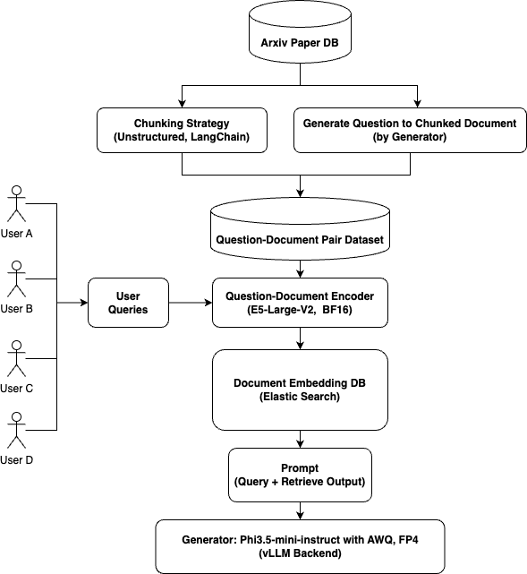

# 🤔 QA System for Arxiv Paper

This project is a QA system for arxiv papers. The system is designed to answer questions based on the content of the paper. The system is built using the [RAG](https://arxiv.org/abs/2104.08691) architecture. The modules of the system are as follows:

- **🔭 Query Encoder/Document Encoder (Retriever)**
  - library: sentence_transformers, transformers, torch
  - foundation model: sentence-transformers/all-MiniLM-L6-v2
  - fine-tune method: metric learning(contrastive loss, multiple negative ranking loss)
  - fine-tune dataset: question-document relation dataset (custom made) (explain, download)

- **🧠 Generator**
  - library: transformers, torch
  - foundation model: meta-llama/Meta-Llama-3-8B
  - fine-tune method: casual language modeling
  - fine-tune dataset: chunked document from arxiv papers (explain, download)

- **Text Chunk Strategy**
  - library: unstructured, langchain (explain)
  - strategy:
    - 1) split the document into each elements by using unstructured
      - Title, NarrativeText, Formula, Table, FigureCaption
    
    - 2) apply the process of each elements
      - Title & NarrativeText: add the title and narrative text as a single chunk with appropriate seperator (it will be re-split into multiple chunks in the Recursive Chunking Strategy in langchain)
      - Formula: convert python math expression string to latex style code
      - Table: convert table to html table code
      - FigureCaption: add to Table object as a caption tag
  - 
## 📚 System Architecture
